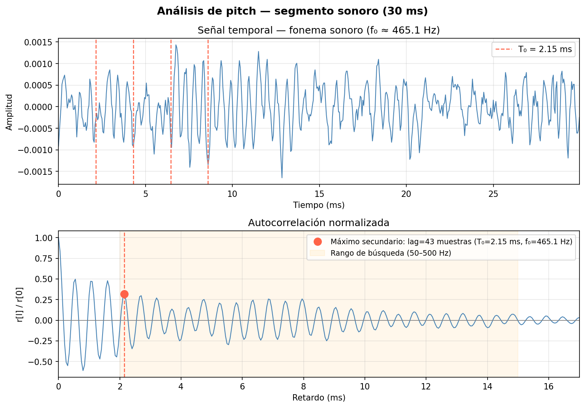
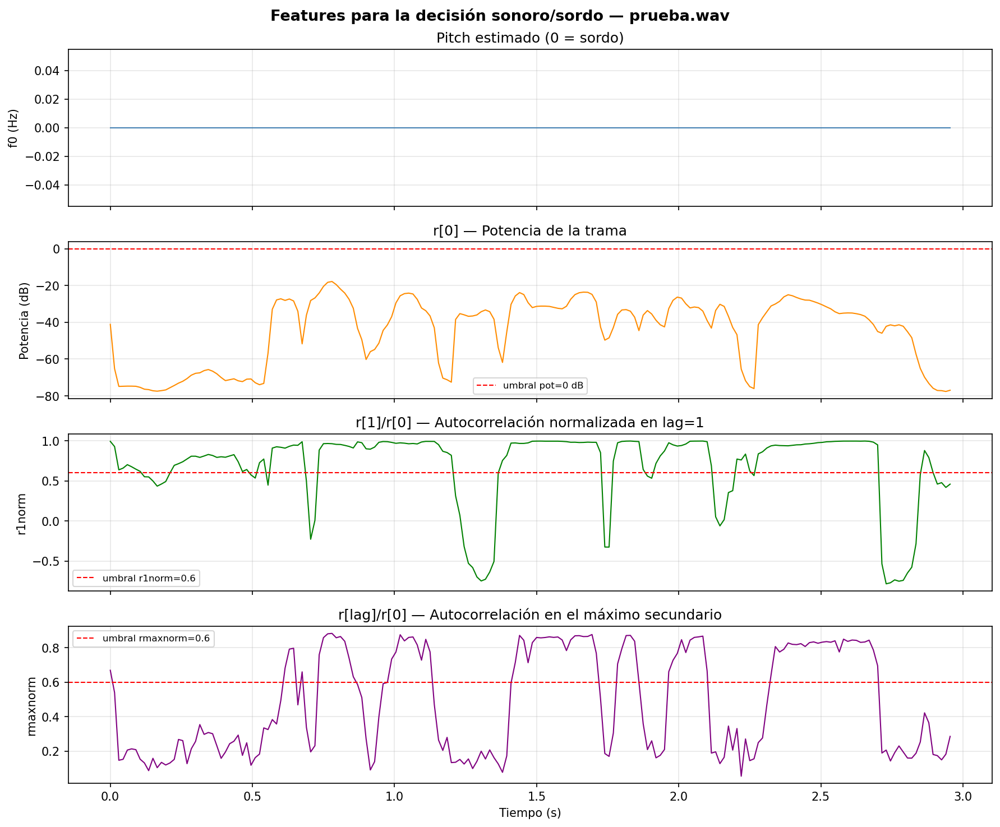
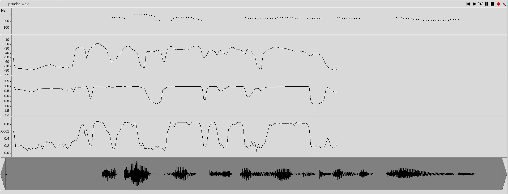
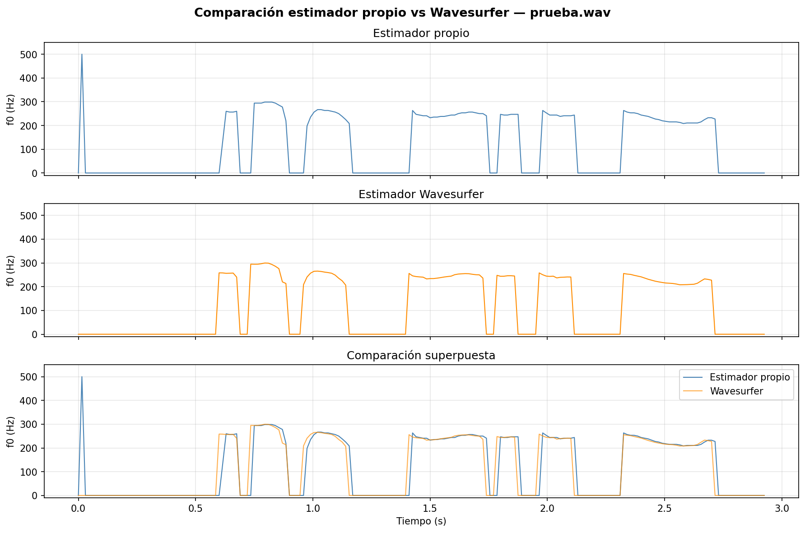
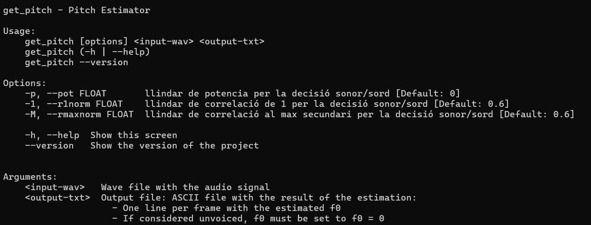

PAV - P3: estimación de pitch
=============================

Esta práctica se distribuye a través del repositorio GitHub [Práctica 3](https://github.com/albino-pav/P3).
Siga las instrucciones de la [Práctica 2](https://github.com/albino-pav/P2) para realizar un `fork` de la
misma y distribuir copias locales (*clones*) del mismo a los distintos integrantes del grupo de prácticas.

Recuerde realizar el *pull request* al repositorio original una vez completada la práctica.

Ejercicios básicos
------------------

- Complete el código de los ficheros necesarios para realizar la estimación de pitch usando el programa
  `get_pitch`.

   * Complete el cálculo de la autocorrelación e inserte a continuación el código correspondiente.

        La autocorrelación de una señal discreta `x[n]` de longitud `N` se define como:

      ```
        r[l] = sum_{n=0}^{N-1-l} x[n] · x[n+l],   l = 0, 1, ..., L-1
      ```

        El código implementado en `pitch_analyzer.cpp` es el siguiente:

      ```cpp
        for (unsigned int l = 0; l < r.size(); ++l) {
          r[l] = 0.0F;
          for (unsigned int n = 0; n < x.size() - l; ++n)
            r[l] += x[n] * x[n + l];
        }
      ```

        La señal `x` ya tiene aplicada la ventana antes de llamar a esta función.
        La ventana de Hamming se ha implementado como:

      ```cpp
        for (unsigned int i = 0; i < frameLen; ++i)
          window[i] = 0.54F - 0.46F * cos(2.0F * M_PI * i / (frameLen - 1));
      ```

   * Inserte una gŕafica donde, en un *subplot*, se vea con claridad la señal temporal de un segmento de
     unos 30 ms de un fonema sonoro y su periodo de pitch; y, en otro *subplot*, se vea con claridad la
	 autocorrelación de la señal y la posición del primer máximo secundario.

        NOTA: es más que probable que tenga que usar Python, Octave/MATLAB u otro programa semejante para
        hacerlo. Se valorará la utilización de la biblioteca matplotlib de Python.

        La siguiente figura muestra un segmento de 30 ms en una zona sonora de `prueba.wav`.
        En el subplot superior se aprecia la periodicidad de la señal con el periodo T₀ marcado.
        En el subplot inferior se muestra la autocorrelación normalizada `r[l]/r[0]`, donde el
        primer máximo secundario (en rojo) indica el periodo fundamental.

      


   * Determine el mejor candidato para el periodo de pitch localizando el primer máximo secundario de la
     autocorrelación. Inserte a continuación el código correspondiente.

        Para localizar el primer máximo secundario se restringe la búsqueda al rango de lags válidos:
        desde `npitch_min` (lag correspondiente a la frecuencia máxima, 500 Hz) hasta `npitch_max`
        (lag correspondiente a la frecuencia mínima, 50 Hz). Fuera de ese rango no tiene sentido buscar
        un periodo de pitch válido.

        El máximo de `r[l]` en ese intervalo se localiza con un bucle lineal:

      ```cpp
        iRMax = r.begin() + npitch_min;
        for (iR = iRMax; iR < r.begin() + npitch_max; iR++) {
          if (*iR > *iRMax) {
            iRMax = iR;
          }
        }
        unsigned int lag = iRMax - r.begin();
      ```

        El lag resultante determina el periodo fundamental estimado, y el pitch se calcula como
        `f0 = fs / lag`. Si la trama se clasifica como sorda, se devuelve `f0 = 0`.

   * Implemente la regla de decisión sonoro o sordo e inserte el código correspondiente.

        La decisión sonoro/sordo se basa en tres features calculadas por trama:

        - **`pot`** — potencia en dB: `10·log10(r[0])`. Las tramas sordas tienen poca energía.
        - **`r1norm`** — autocorrelación normalizada en lag=1: `r[1]/r[0]`. Mide la suavidad
          espectral; valores altos indican señal periódica.
        - **`rmaxnorm`** — autocorrelación normalizada en el máximo secundario: `r[lag]/r[0]`.
          Mide directamente la periodicidad de la señal al periodo de pitch.

        Los tres umbrales se parametrizan desde la línea de comandos mediante `docopt_cpp`
        (opciones `-p`, `-1`, `-M`), lo que permite optimizarlos sin recompilar. La regla
        declara una trama como **sorda** si se cumple cualquiera de estas condiciones:

      ```cpp
        bool PitchAnalyzer::unvoiced(float pot, float r1norm, float rmaxnorm) const {
          if (pot < llindar_pot) return true;
          if (r1norm < llindar_r1norm) return true;
          if (rmaxnorm < llindar_rmaxnorm) return true;
          return false;
        }
      ```

        Los valores por defecto son `pot=0 dB`, `r1norm=0.6`, `rmaxnorm=0.6`, y se refinan
        tras el análisis con `wavesurfer` y la evaluación con `pitch_evaluate`.

   * Puede serle útil seguir las instrucciones contenidas en el documento adjunto `código.pdf`.

- Una vez completados los puntos anteriores, dispondrá de una primera versión del estimador de pitch. El 
  resto del trabajo consiste, básicamente, en obtener las mejores prestaciones posibles con él.

  * Utilice el programa `wavesurfer` para analizar las condiciones apropiadas para determinar si un
    segmento es sonoro o sordo. 
	
	  - Inserte una gráfica con la estimación de pitch incorporada a `wavesurfer` y, junto a ella, los 
	    principales candidatos para determinar la sonoridad de la voz: el nivel de potencia de la señal
		(r[0]), la autocorrelación normalizada de uno (r1norm = r[1] / r[0]) y el valor de la
		autocorrelación en su máximo secundario (rmaxnorm = r[lag] / r[0]).

		Puede considerar, también, la conveniencia de usar la tasa de cruces por cero.

	    Recuerde configurar los paneles de datos para que el desplazamiento de ventana sea el adecuado, que
		en esta práctica es de 15 ms.

      - Use el estimador de pitch implementado en el programa `wavesurfer` en una señal de prueba y compare
	    su resultado con el obtenido por la mejor versión de su propio sistema.  Inserte una gráfica
		ilustrativa del resultado de ambos estimadores.
     
		Aunque puede usar el propio Wavesurfer para obtener la representación, se valorará
	 	el uso de alternativas de mayor calidad (particularmente Python).

        Para analizar las condiciones de sonoridad se ha activado la impresión de features por stdout
        redirigiendo la salida a un fichero:

      ```bash
        get_pitch prueba.wav prueba.f0 > features.txt
      ```

        La figura siguiente muestra la evolución temporal del pitch estimado junto a las tres features
        utilizadas para la decisión sonoro/sordo, con los umbrales iniciales marcados en rojo:

      

        Se puede observar que:
        - La **potencia** (`r[0]`) cae claramente en las zonas sordas (silencios, fricativas).
        - La **r1norm** (`r[1]/r[0]`) es alta en zonas sonoras y baja en zonas sordas.
        - La **rmaxnorm** (`r[lag]/r[0]`) es el indicador más discriminante: supera 0.6 solo
          en tramas con periodicidad clara.

        La siguiente captura muestra el análisis en `wavesurfer` con el estimador de pitch
        incorporado y los paneles de features con desplazamiento de ventana de 15 ms:

      

        Se ha comparado el estimador implementado con el estimador interno de `wavesurfer`
        sobre la señal `prueba.wav`. La figura siguiente muestra los contornos de f0 obtenidos
        por ambos sistemas:

      

        De la comparación se extraen las siguientes conclusiones:

        - En las zonas claramente sonoras (t ≈ 0.6–3.0 s) ambos estimadores coinciden en el
          rango de frecuencia fundamental (200–300 Hz), lo que valida el funcionamiento
          del estimador implementado.
        - El estimador propio produce contornos más **estables y suaves**, con valores
          prácticamente constantes dentro de cada zona sonora.
        - El estimador de `wavesurfer` presenta más **picos espurios** y variabilidad,
          especialmente en las transiciones entre zonas sonoras y sordas.
        - El estimador propio presenta un **falso positivo al inicio** (t ≈ 0 s) que podría
          eliminarse con un filtro de mediana en el postprocesado.

          
  
  * Optimice los parámetros de su sistema de estimación de pitch e inserte una tabla con las tasas de error
    y el *score* TOTAL proporcionados por `pitch_evaluate` en la evaluación de la base de datos 
	`pitch_db/train`..

        Se ha realizado una búsqueda sistemática de los umbrales óptimos mediante un script que
        evalúa combinaciones en una rejilla de valores, primero con paso grueso y luego refinando
        alrededor del mejor resultado.

        Los umbrales óptimos encontrados son:

        | Parámetro     | Valor inicial | Valor optimizado |
        |---------------|---------------|------------------|
        | `pot`         | -40 dB        | -46 dB           |
        | `r1norm`      | 0.75          | 0.55             |
        | `rmaxnorm`    | 0.45          | 0.40             |

        Los resultados de `pitch_evaluate` sobre `pitch_db/train` con los umbrales optimizados son:

        | Métrica                              | Valor              |
        |--------------------------------------|--------------------|
        | Tramas totales                       | 11200              |
        | Tramas sordas                        | 7045               |
        | Tramas sonoras                       | 4155               |
        | Sordas clasificadas como sonoras     | 296/7045 (4.20 %)  |
        | Sonoras clasificadas como sordas     | 400/4155 (9.63 %)  |
        | Errores gruesos de pitch (+20 %)     | 56/3755 (1.49 %)   |
        | MSE errores finos                    | 2.42 %             |
        | **Score TOTAL**                      | **90.76 %**        |

        El error dominante es el de sonoras clasificadas como sordas (9.63 %), lo que indica que
        los umbrales siguen siendo algo conservadores. El error de falsas alarmas (sordas como
        sonoras) es bajo (4.20 %), lo que significa que el sistema es más propenso a perderse
        tramas sonoras que a inventarlas.

Ejercicios de ampliación
------------------------

- Usando la librería `docopt_cpp`, modifique el fichero `get_pitch.cpp` para incorporar los parámetros del
  estimador a los argumentos de la línea de comandos.
  
  Esta técnica le resultará especialmente útil para optimizar los parámetros del estimador. Recuerde que
  una parte importante de la evaluación recaerá en el resultado obtenido en la estimación de pitch en la
  base de datos.

  * Inserte un *pantallazo* en el que se vea el mensaje de ayuda del programa y un ejemplo de utilización
    con los argumentos añadidos.

        Se ha modificado `get_pitch.cpp` para incorporar los tres umbrales de la decisión
        sonoro/sordo como opciones de la línea de comandos usando `docopt_cpp`:

      ```cpp
        static const char USAGE[] = R"(
        get_pitch - Pitch Estimator

        Usage:
            get_pitch [options] <input-wav> <output-txt>
            get_pitch (-h | --help)
            get_pitch --version

        Options:
            -p, --pot FLOAT       llindar de potencia per la decisió sonor/sord [Default: 0]
            -1, --r1norm FLOAT    llindar de correlació de 1 per la decisió sonor/sord [Default: 0.6]
            -M, --rmaxnorm FLOAT  llindar de correlació al max secundari per la decisió sonor/sord [Default: 0.6]
            -h, --help            Show this screen
            --version             Show the version of the project
        )";
      ```

        Los valores se leen con `stof()` y se pasan al constructor de `PitchAnalyzer`:

      ```cpp
        float llindar_pot      = stof(args["--pot"].asString());
        float llindar_r1norm   = stof(args["--r1norm"].asString());
        float llindar_rmaxnorm = stof(args["--rmaxnorm"].asString());

        PitchAnalyzer analyzer(n_len, rate, PitchAnalyzer::RECT, 50, 500,
                                llindar_pot, llindar_r1norm, llindar_rmaxnorm);
      ```

        Ejemplo de uso con umbrales personalizados:

      ```bash
        get_pitch -p -40 -1 0.75 -M 0.45 prueba.wav prueba.f0
      ```

      

- Implemente las técnicas que considere oportunas para optimizar las prestaciones del sistema de estimación
  de pitch.

  Entre las posibles mejoras, puede escoger una o más de las siguientes:

  * Técnicas de preprocesado: filtrado paso bajo, diezmado, *center clipping*, etc.
  * Técnicas de postprocesado: filtro de mediana, *dynamic time warping*, etc.
  * Métodos alternativos a la autocorrelación: procesado cepstral, *average magnitude difference function*
    (AMDF), etc.
  * Optimización **demostrable** de los parámetros que gobiernan el estimador, en concreto, de los que
    gobiernan la decisión sonoro/sordo.
  * Cualquier otra técnica que se le pueda ocurrir o encuentre en la literatura.

  Encontrará más información acerca de estas técnicas en las [Transparencias del Curso](https://atenea.upc.edu/pluginfile.php/2908770/mod_resource/content/3/2b_PS%20Techniques.pdf)
  y en [Spoken Language Processing](https://discovery.upc.edu/iii/encore/record/C__Rb1233593?lang=cat).
  También encontrará más información en los anexos del enunciado de esta práctica.

  Incluya, a continuación, una explicación de las técnicas incorporadas al estimador. Se valorará la
  inclusión de gráficas, tablas, código o cualquier otra cosa que ayude a comprender el trabajo realizado.

  También se valorará la realización de un estudio de los parámetros involucrados. Por ejemplo, si se opta
  por implementar el filtro de mediana, se valorará el análisis de los resultados obtenidos en función de
  la longitud del filtro.

      Se ha aplicado **center clipping** sobre la señal de entrada antes de calcular la
      autocorrelación. Esta técnica pone a cero las muestras cuya amplitud está por debajo
      de un umbral `C`, calculado como una fracción de la amplitud máxima de la señal.
      El efecto es eliminar el ruido de baja amplitud y reforzar la periodicidad de la señal,
      lo que mejora la definición del máximo secundario de la autocorrelación.

    ```cpp
      float C = 0.02F;
      float x_max = *max_element(x.begin(), x.end());
      float clip_threshold = C * x_max;
      for (auto& sample : x)
        if (fabs(sample) < clip_threshold)
          sample = 0.0F;
    ```

      Se ha aplicado un **filtro de mediana de longitud 3** sobre el vector de pitch estimado.
      Este filtro elimina picos aislados (errores puntuales de estimación) sin afectar a las
      transiciones sonoro/sordo. Para cada trama, se calcula la mediana entre ella y sus dos
      vecinas, sustituyendo el valor original por la mediana.

    ```cpp
      int median_len = 3;
      vector<float> f0_filtered(f0.size());
      for (int i = 0; i < (int)f0.size(); ++i) {
        vector<float> window;
        for (int j = i - median_len/2; j <= i + median_len/2; ++j) {
          if (j >= 0 && j < (int)f0.size())
            window.push_back(f0[j]);
          else
            window.push_back(0.0F);
        }
        sort(window.begin(), window.end());
        f0_filtered[i] = window[window.size()/2];
      }
      f0 = f0_filtered;
    ```
      | Métrica                              | Sin mejoras  | Con mejoras  |
      |--------------------------------------|--------------|--------------|
      | Sordas clasificadas como sonoras     | 296/7045 (4.20 %) | 200/7045 (2.84 %) |
      | Sonoras clasificadas como sordas     | 400/4155 (9.63 %) | 380/4155 (9.15 %) |
      | Errores gruesos de pitch (+20 %)     | 56/3755 (1.49 %)  | 48/3775 (1.27 %) |
      | MSE errores finos                    | 2.42 %       | 2.66 %       |
      | **Score TOTAL**                      | **90.76 %**  | **91.64 %**  |

      Las mejoras aplicadas son center clipping en el preprocesado y filtro de mediana
      de longitud 3 en el postprocesado. El score sube de 90.76% a 91.64%, con reducción
      notable de falsas alarmas (4.20% → 2.84%) y de errores gruesos (1.49% → 1.27%).


Evaluación *ciega* del estimador
-------------------------------

Antes de realizar el *pull request* debe asegurarse de que su repositorio contiene los ficheros necesarios
para compilar los programas correctamente ejecutando `make release`.

Con los ejecutables construidos de esta manera, los profesores de la asignatura procederán a evaluar el
estimador con la parte de test de la base de datos (desconocida para los alumnos). Una parte importante de
la nota de la práctica recaerá en el resultado de esta evaluación.
